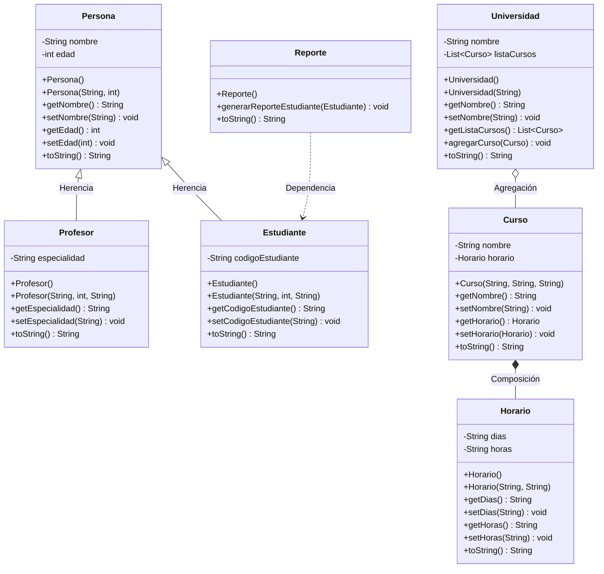

# Laboratorio 02: Tecnología de Objetos - Relaciones entre Clases en Java

Este repositorio contiene la implementación de un sistema de gestión universitaria en Java, diseñado para demostrar y analizar los cuatro tipos fundamentales de relaciones en la Programación Orientada a Objetos (POO): **Herencia**, **Composición**, **Agregación** y **Dependencia**, aplicando la convención estándar JavaBeans.

---

## Estructura de Relaciones del Sistema

* **Herencia (`Persona` $\rightarrow$ `Profesor`, `Estudiante`):** Especialización de la clase base `Persona` (nombre, edad) hacia clases derivadas con atributos propios (`especialidad` y `codigoEstudiante`).
* **Composición (`Curso` $\blacklozenge\!\!-$ `Horario`):** Relación fuerte de pertenencia. La instancia de `Horario` nace y existe únicamente dentro del ciclo de vida del `Curso`.
* **Agregación (`Universidad` $\lozenge\!\!-$ `Curso`):** Relación débil de pertenencia. La `Universidad` agrupa una lista de cursos, pero la existencia de cada `Curso` es independiente a la institución.
* **Dependencia (`Reporte` $-\!\!-\!\rightarrow$ `Estudiante`):** Relación de uso transitorio. El método generador de reportes recibe como parámetro temporal una instancia de `Estudiante` sin retener su referencia como atributo.

---

## Diagrama de Clases UML



---

## Compilación y Ejecución

Para compilar y ejecutar el proyecto desde la terminal o Visual Studio Code:

```bash
# Compilar el archivo principal
javac Main.java

# Ejecutar el programa
java Main
```

---

## Preguntas y Respuestas

### 1. ¿Qué diferencias puede resaltar en las implementaciones de los dos lenguajes de programación en POO? *(Java vs. Python)*

Al comparar la solución en **Java** frente a una implementación equivalente en **Python**, destacan tres contrastes sustanciales:

* **Control de Visibilidad y Encapsulamiento:**
  * **Java:** Utiliza un encapsulamiento estricto a nivel de lenguaje mediante palabras reservadas (`private`, `public`, `protected`). El acceso a los atributos privados fuera de la clase es bloqueado de forma determinante en tiempo de compilación.
  * **Python:** Maneja el encapsulamiento por convención cultural (*"consenting adults"*). El prefijo simple `_` advierte un uso protegido/interno, y el prefijo doble `__` activa una alteración de nombres (*name mangling*), pero no existe una restricción física de acceso a nivel de compilador.

* **Sistema de Tipos y Comprobación de Interfaces:**
  * **Java:** Tipado estático y nominal. Al definir la relación de dependencia en `Reporte.generarReporteEstudiante(Estudiante e)`, el parámetro debe ser obligatoriamente del tipo `Estudiante` (o un subtipo de él) validado antes de la ejecución.
  * **Python:** Tipado dinámico mediante *Duck Typing*. La función receptora del reporte aceptará cualquier objeto que posea los atributos requeridos (`nombre`, `edad`, `codigo`), independientemente de su jerarquía formal de clases o herencia.

* **Sintaxis y Estándar de Implementación:**
  * **Java:** Exige una estructura más verbosa orientada a la convención JavaBeans (múltiples constructores, *getters*, *setters* y métodos utilitarios como `toString()`).
  * **Python:** Centraliza la inicialización en el método `__init__`, la representación en `__str__`, y prescinde de métodos accesores redundantes a menos que se usen decoradores `@property`.

---

### 2. ¿En su implementación dónde se puede evidenciar la protección de datos o la seguridad utilizando la técnica de la programación orientada a objetos?

La integridad y seguridad de la información dentro del sistema se evidencia en tres áreas técnicas:

* **Ocultamiento de Información (*Information Hiding*):**
  Todos los atributos de las entidades (`Persona`, `Curso`, `Horario`, `Universidad`) están tipificados como `private`. Esto previene mutaciones arbitrarias e incontroladas del estado interno desde clases externas (por ejemplo, asignar valores nulos o edades negativas), canalizando todo cambio a través de métodos accesores (*getters* y *setters*) que actúan como compuertas lógicas seguras.

* **Encapsulamiento del Ciclo de Vida por Composición:**
  En la relación `Curso` - `Horario`, la instancia de `Horario` se construye de forma interna dentro del constructor de `Curso`. Esto impide que un `Horario` quede huérfano, sea compartido de forma inconsistente con otros cursos, o que exista un `Curso` en estado incompleto sin asignación horaria.

* **Aislamiento de Ámbito en la Dependencia:**
  En la clase `Reporte`, la relación con `Estudiante` es puramente transitoria por parámetro de método. Al no guardarse una referencia de `Estudiante` como atributo persistente de `Reporte`, se evita la persistencia innecesaria en memoria y se neutraliza cualquier posibilidad de efectos secundarios colaterales (*side-effects*) sobre los datos del alumno.

## Comparativa Técnica: Java vs Python vs C++

| Característica | Java | Python | C++ |
| :--- | :--- | :--- | :--- |
| **Modelo de Ejecución** | Híbrido (compilado a Bytecode y ejecutado por la JVM). Muy balanceado y multiplataforma. | Interpretado. Ideal para programar rápido, pero su ejecución es un poco más lenta al ser traducida al vuelo. | Compilado a código máquina. Extremadamente veloz porque interactúa directo con el procesador. |
| **Gestión de Memoria** | Automática mediante Garbage Collector. Te olvidas de limpiar la memoria, Java lo hace por ti. | Automática mediante Garbage Collector. Muy cómodo y evita errores de pérdida de memoria. | Manual o semi-automática (RAII). Tienes control total; tú eres responsable de la limpieza o de usar punteros inteligentes. |
| **Tipado** | Estático y estricto. Declaras el tipo desde el principio y se respeta en todo momento. | Dinámico por naturaleza. Aunque en nuestra versión usamos 	yping para simular un control estricto. | Estático y riguroso. Control absoluto sobre los tipos, punteros y referencias de memoria. |
| **Verbosidad/Sintaxis** | Verboso. Te obliga a escribir explícitamente public, private, setters, getters y usar punto y coma. | Amigable y directa. Menos líneas de código, se lee casi como inglés y usa indentación en lugar de llaves. | Compleja pero poderosa. Requiere entender la sintaxis de punteros (*) y direcciones de memoria (&). |
